= Repertorio Candelaria 2026
v0.1.3, 2026-01-26
:toc: left
:toc-title: Índice
:sectanchors:
:sectnums:
:sectnumlevels: 1
:icons: font

== Bloque 1

=== J.J.

[source]
----
3 2 3 2   32  56
 2 2 2 122  44  6

 333  55    333  55     5   56
4   34  5556   34  55565 443

2 3  56
 2 43  6
----

audio::./audio/jj.mpeg[]

=== Abelito

   2 333 33-322 233    3    5   5    56
  4 2   3      1   33-3 3444 555 4334  6

   5    5    3333223    3    5    5    56
  5 4433 55-5       33-3 3444 55-5 4334  6

  332    5    56
     33-5 4334  6

Parte I::
Hoy cuanto vale un veintisiete, +
es como el sol en su lago +
lucero inmenso del mañana, +
es lo que vale un veintisiete. +
(BIS)
+
Cuando pregunten a los Apus, +
el Cancharani respondera, +
el Azoguine, Huajsapata, +
cuanto vale un veintisiete. +
(BIS)
+
Con sicuris, nunca olvides Abelito. +
(BIS)

Parte II::
Si quieren callar a tu pueblo, +
defenderás buen guerrero, +
Sicuri apu sartañiri +
toma el valor veintisiete. +
(BIS)
+
Por eso cuando te reclamen, +
levantarás el Jake Aru, +
el gran vocero de tu pueblo, +
toma el valor veintisiete. +
(BIS)
+
Con sicuris, nunca olvides Abelito. +
(BIS)

=== Linda Sialeña

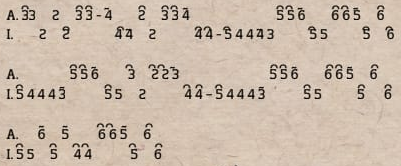

En las orillas de un lago azul, +
linda sialeña, +
tu amor me haz jurado cholita, +
para toda la vida.

Aunque preferiste alejarte, +
no podrás olvidarte, +
de aquellos momentos felices, +
que juntos pasamos

Linda sialeña, flor encantadora

audio::./audio/linda-sialena.mpeg[]

=== Ponchera

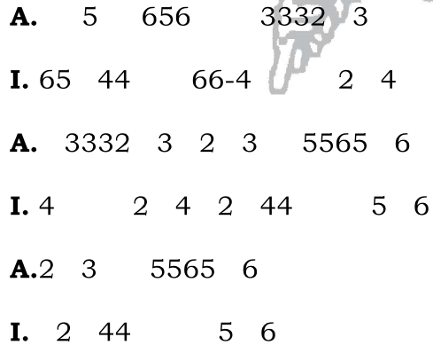

Ay! ponchera de las fiestas, +
testigo de los sicuris. (BIS) +

No murmures que me vaya, de esta tierra, +
dejando estas melodías. (BIS) +

27, eternos somos AJP. (BIS) +

== Bloque 2

=== Chuyma Marka

_Liber Cahui Bustincio_

NOTE: Huayno Ligero

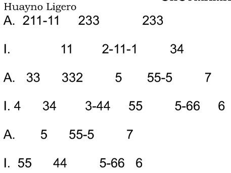

=== Gabrielita

=== Paja brava

_Rosendo Huirse_

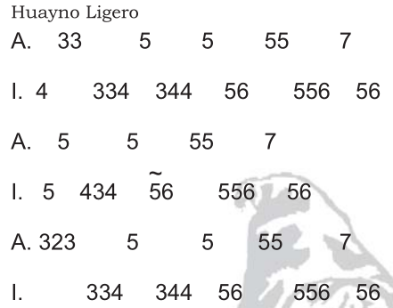

Parte I::
Todos me llaman paja brava cholit@, +
Porque vivo en el campo +
(BIS)
+
Con el agua, con el viento, +
Verde nomás me mantengo +
(BIS)
+
Ayayay cholit@, verde nomás me mantengo. +
(BIS)

Parte II::
Los que tienen padre y madre cholit@, +
Dicen que tienen caudales. +
(BIS)
+
Yo no tengo padre ni madre, +
Ni un perrito que me ladre. +
(BIS)
+
Ayayay cholit@, ni un perrito que me ladre. +
(BIS)

audio::./audio/paja-brava.mpeg[]

=== Virginia

_Gustavo Alatrista_

NOTE: Huayno Ligero

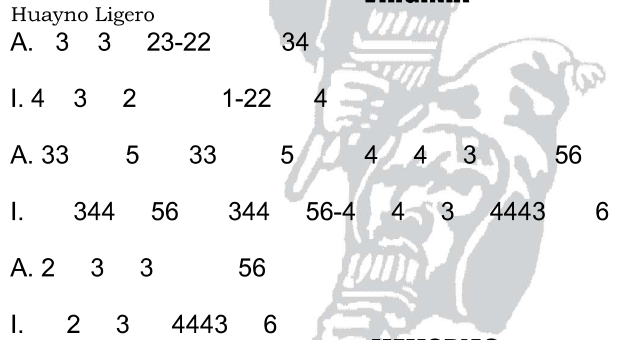

Voy a pedir hoy, que doblen las +
campanas de mi corazón, +
porque mañana me muero +
y tú me has dejado sin tu amor; +
Virginia tú eres la causa, +
de este cariño que mata con tus +
crueles desatinos. yo ya estoy +
muriendo por tu amor +
eres tu virginia +
la causa de este amor

Del cielo voy a enviarte +
mis caricias y mi devoción +
para que te vengas pronto +
a quererme más y más que ayer +
Virginia tú eres la causa, +
de este cariño que mata +
con tus crueles desatinos +
yo ya estoy muriendo +
por tu amor

== Bloque 3

=== Cuando me vaya

audio::./audio/cuando-me-vaya.mp4[]

=== Nostalgia

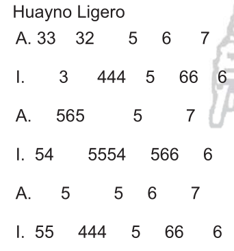

audio::./audio/nostalgia.mpeg[]

Parte I::
Quien tiene tu ensueño +
paloma +
que el viento susurra.
+
Tenía una amante ilusión +
pérdida en el tiempo.
+
Sin su cariño +
triste era la vida.

Parte II::
Quiso el destino un día +
robarme su amor.
+
La pena es más pena +
y su amor +
lejano y ausente.
+
Sin sus caricias +
que será la vida.

=== Jilata

NOTE: Huayno Ligero

Parte I::
Mañana cuando tu te vayas, jilata, +
haz de añorar tu sicuri. +
(BIS)
+
Recordarás lindas imillas, jake, +
y al próximo año regresarás. +
(BIS)
+
Jilata, al 27 regresarás, +
Wayquicha, al 27 regresarás.

Parte II::
Hermano sicuri recordarás ahora, +
todo el amor que perdistes. +
(BIS)
+
Con lealtad y compromiso eterno, +
a los principios del sicuri. +
(BIS)
+
Jilata de corazón veintisiete, +
Wayquicha de corazón AJP.

audio::./audio/jilata.mpeg[]

=== La Morena

audio::./audio/morena.aac[]

Linda morenita de mi vida juraste ser mi compañera +
(BIS)

Ahora que el tiempo ya ha pasado porque pretendes olvidarme +
(BIS)

Pagarás esa culpa ante la mirada de tus ojos. +
(BIS)

== Bloque 4

=== Boqueron abandonado

NOTE: Huayno Ligero

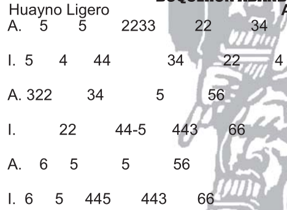

=== Hortencia

_Captacion Qhantati Ururi_

Parte I::
Entre las flores de mi jardin, +
Hortencia, tu eres la mas preferida +
por eso te quiero. +
tomaremos una copa, +
tomaremos otra copa +
sausin inganista, tanta normalista +
Ayayayay. +
uta sausin inganista tanta normalista.

Parte II::
Para qué quiero yo la vida, para qué, +
si ya no tengo tu cariño +
que me dio la vida. +
Mi corazón, yo te lo di, Hortencia +
No llores, ni tengas miedo, +
porque yo te quiero. +
Ayayayay. +
No llores, ni tengas miedo, porque yo te quiero.

=== Calavera

NOTE: Huayno Ligero

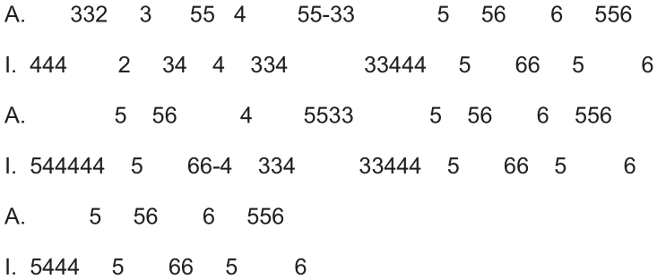

Todos me dicen que soy calavera +
mentira no soy, soy un bohemio, +
que canta sus penas +
con su requinto

Y así cantando en noches serenas +
junto a tu ventana +
huaynitos lindos, huaynitos serranos +
para tí mi querer.

Entre mil rosas, entre mil guindales +
te voy mirando +
Chucuiteña de mis esperanzas +
suma pangarita

Eres mi dicha, eres mi esperanza +
línda paisanita +
mi corazón no tiene descanso +
solo por tu querer.

Chucuito lindo asqui unajalsu +
de aguas cristalinas +
lava las manchas de tus malos hijos +
para tu consuelo.

Y así algún día en tu suelo virgen +
renacerán pues +
las lindas rosas, las lindas cantutas +
de otros tiempos.

=== Flor puneña

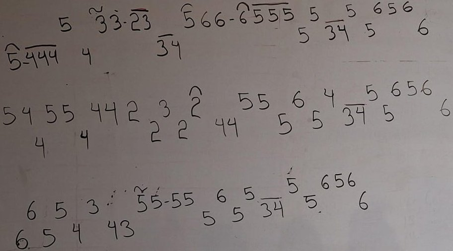

Quisiera tenerte aquí siempre a mí lado, +
quisiera tenerte siempre en cada amanecer.

Porque mi cruel soledad juega con martirios, +
estoy perdiendo mi vida al no poderte olvidar, +
eres amor imposible linda flor puneña

== Huaynos Calmados

=== Agua Milagro

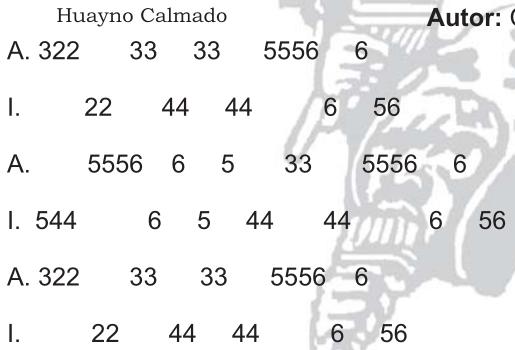

Cariño sobre cariño +
yo te conoci +
conimeñita linda +
de mis amores.

Agua milagro me distes +
como una prueba de amor, +
pero tu me traicionaste +
sin compasion.

=== Camacho

Pronto disponible

=== Despedida Puneña

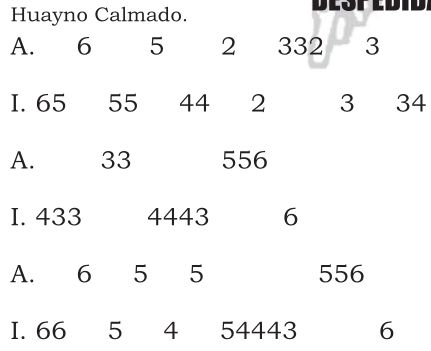

Parte I::
Compuertas del alto Puno +
tu no ma sabes como lloré. +
Al despedirme +
como sangraba mi corazon. +
Ay! mi palomita, +
cómo sangraba mi corazón.

Parte II::
Con un puñal en la mano, +
quien te ha obligado que me quieras. +
Ni tampoco nadie a forzado tu  voluntad. +
Ay! mi palomita, +
nadie ha forzado tu voluntad.

=== Treinta años

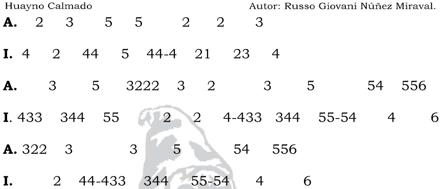

=== Kalauyo

NOTE: Huayno Calmado

audio::./audio/kalahuyo.mpeg[]

Kalahuyu rincón huraño, +
en donde el pajonal ruge, +
y el viento quema. (3L-bis) +
Donde los frondosos q'ullis, +
como vigías contamplan +
las añoranzas de mi querer. (3L-bis) +
Ayayay negra, las añoranzas de mi querer.

El arbol que crece en sombras, +
entre rocas y peñasco, +
de nuestro amor sabe. (3L-bis) +
Los truenos son delatores, +
y las noches son testigos +
de las ansias de quererte. (3L-bis) +
Ayayay negra, de las ansias de quererte. +
(BIS)

== Miscelánea

=== Diana Juventud

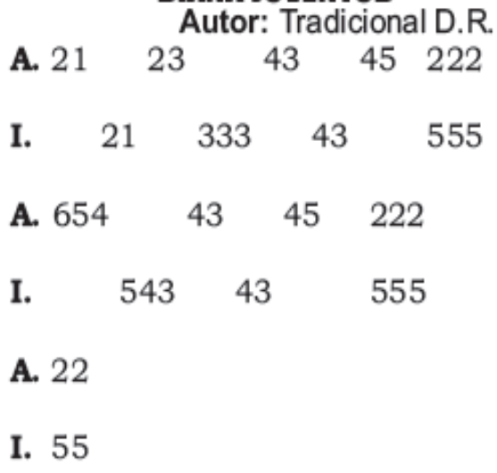

=== Diana H'atariy

_Mario Hilari Calderón_

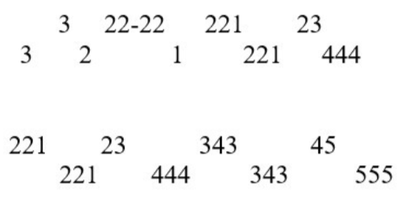

=== Flavio

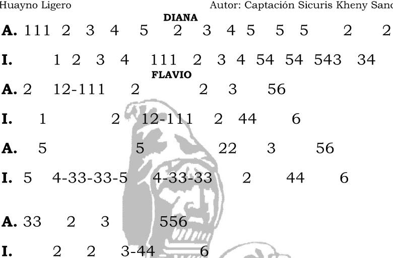

=== Veinti-nueve (29) de septiembre

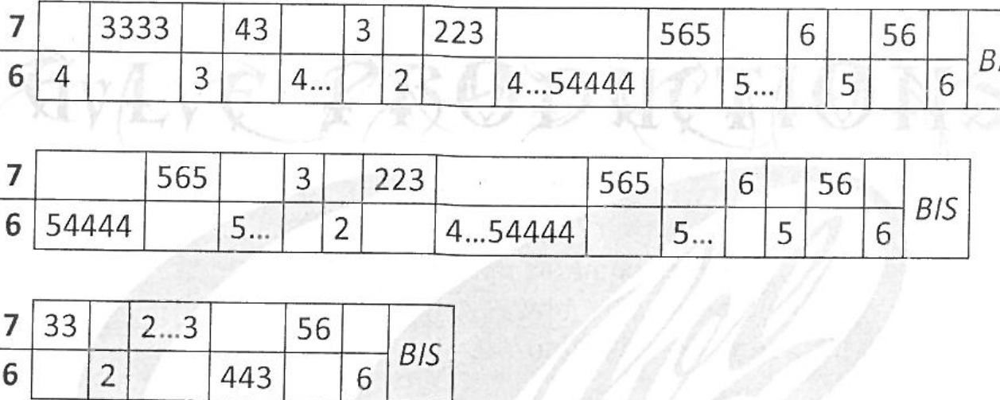

audio::./audio/29-septiembre.mpeg[]

Parte I::
Un 29 de septiembre, yo te +
conocido, al compas de las +
melodias de nuestro sicuri. +
(BIS)
+
En las visperas de San Miguel, al +
pie de su altar, juraste ser mi +
compañera, recuerdo imborrable. +
(BIS)
+
Huancaneña, recuerdo +
imborrable. +
(BIS)

Parte II::
Que més pruebas de mi carifio +
quieres huancaneña, si hasta en +
las rocas del calvario se +
encuentra tu nombre. +
(BIS)
+
Bajo las sombras de tus cactus te +
tuve en mis brazos bebiendo el +
néctar cristalino de tus labios +
rojos. +
(BIS)
+
Huancaneña, de tus labios rojos. +
(BIS)

Parte III::
Hermosa chola huancaneña, +
vives orgullosa, en el fragor de +
tus avales al pie del coloso. +
(BIS)
+
En las arenas de tu playa escribí +
tu nombre mirando el cielo de tus +
ojos, todo un arco iris. +
(BIS)
+
Huancaneña, todo un arco iris. +
(BIS)
