= Repertorio Candelaria 2026
AJP 27 de Junio
:toc: auto
:toc-title: Índice
:sectanchors:
:sectnumlevels: 2
:icons: font
:imagesdir: ./assets/
:stylesdir: ./css/
:stylesheet: asciidoctor.css
:experimental:
v0.1.7

:sectnums!:
== Versión móvil PDF

https://github.com/7824b17e-37cf-4cb7-8ce4-852ac11a096d

https://github.com/laniakea-io/siku/blob/main/mobile.pdf[Versión móvil PDF]

== Código QR del sitio web

:sectnums:

//<<< autogenerated: created from 'repertorio.js' and 'repertorio.toml'
include::repertorio.adoc[]
//>>>

== Linda Sialeña

audio::audio/linda-sialena.mpeg[]

En las orillas de un lago azul, linda sialeña, tu amor me haz jurado cholita, para toda la vida.

Aunque preferiste alejarte, no podrás olvidarte, de aquellos momentos felices, que juntos pasamos.

Linda sialeña, flor encantadora

== Ponchera

_Arcadio Calderón_

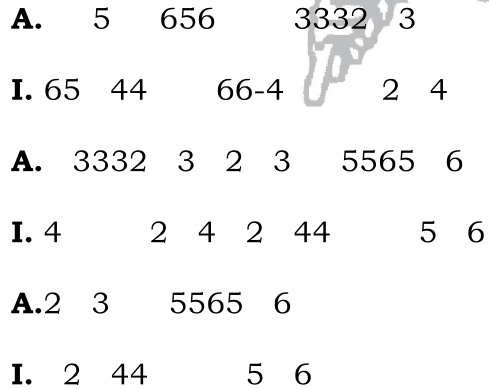

Ay! ponchera de las fiestas, testigo de los sicuris. +

No murmures que me vaya, de esta tierra, dejando estas melodías. +

Veintisiete (27), eternos somos AJP.

== Paja brava

NOTE: Huayno Ligero

_Rosendo Huirse_

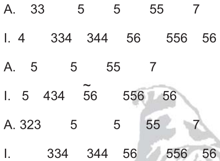

audio::audio/paja-brava.mpeg[]

Parte I::
Todos me llaman paja brava cholit@, porque vivo en el campo.
+
Con el agua, con el viento, verde nomás me mantengo.
+
Ayayay cholit@, verde nomás me mantengo. +

Parte II::
Los que tienen padre y madre cholit@, dicen que tienen caudales.
+
Yo no tengo padre ni madre, ni un perrito que me ladre.
+
Ayayay cholit@, ni un perrito que me ladre.

== Jilata

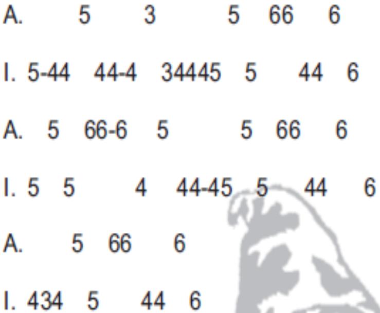

audio::audio/jilata.mpeg[]

Parte I::
Mañana cuando tu te vayas, jilata, haz de añorar tu sicuri.
+
Recordarás lindas imillas, jake, y al próximo año regresarás.
+
Jilata, al 27 regresarás, Wayquicha, al 27 regresarás.

Parte II::
Hermano sicuri recordarás ahora, todo el amor que perdistes.
+
Con lealtad y compromiso eterno, a los principios del sicuri.
+
Jilata de corazón veintisiete, Wayquicha de corazón AJP.

== La Morena

image::img/morena.jpg[]

audio::audio/morena.aac[]

Linda morenita de mi vida, juraste ser mi compañera +

Ahora que el tiempo ya ha pasado, porque pretendes olvidarme +

Pagarás esa culpa, ante la mirada de tus ojos.

== Boqueron abandonado

NOTE: Huayno Ligero

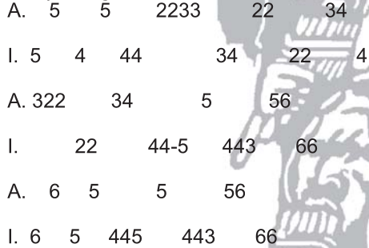

audio::audio/boqueron-abandonado.mpeg[]

== Hortencia

_Captacion Qhantati Ururi_

Parte I::
Entre las flores de mi jardín, Hortencia, tu eres la más preferida, por eso te quiero.
+
Mi corazón, yo te lo di, no llores, no llores, ni tengas pena, porque yo te quiero.
+
Ayayayay, no llores, ni tengas pena, porque yo te quiero.

Parte II::
Para qué quiero yo la vida, para qué, si ya no tengo tu cariño que me dio la vida.
+
tomaremos una copa, tomaremos otra copa, sausin inganista, tanta normalista
+
Ayayayay, uta sausin inganista tanta normalista.

== Calavera

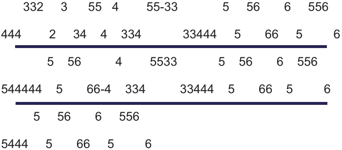

Parte I::
Todos me dicen que soy calavera, mentira no soy, soy un bohemio, que canta sus penas con su requinto
+
Y así cantando en noches serenas, junto a tu ventana, huaynitos lindos, huaynitos serranos, para tí mi querer.
+
Cholita, para tí mi querer, negrita, para tí mi querer.

Parte II::
Chucuito lindo asqui unajalsu, de aguas cristalinas, lava las manchas que en tí han dejado, tus malos hijos
+
Y así algún día en tu suelo virgen renacerán pues, las lindas rosas, las lindas cantutas de otros tiempos.
+
Cholita, de otros tiempos, negrita, de otros tiempos.

Parte III::
Entre mil rosas, entre mil guindales te voy mirando, Chucuiteña de mis esperanzas, suma pangarita.
+
Eres mi dicha, eres mi esperanza, linda paisanita, mi corazón no tiene descanso, solo por tu querer.
+
Cholita, solo por tu querer, negrita, solo por tu querer.

== Flor puneña

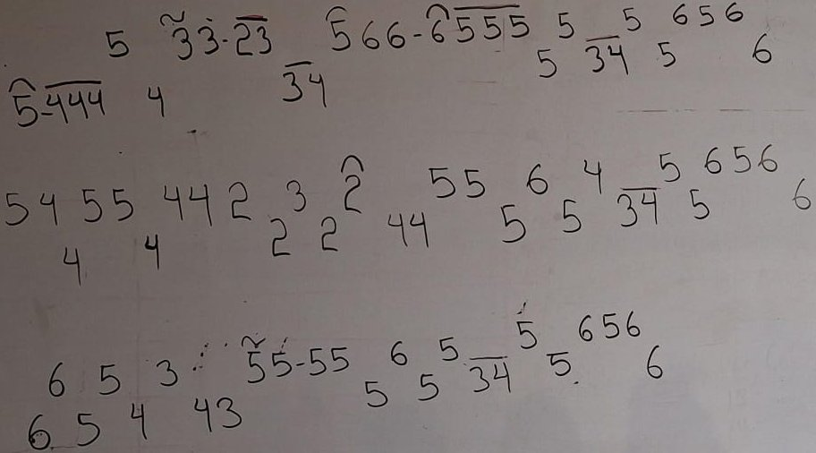

Quisiera tenerte aquí siempre a mí lado, quisiera tenerte siempre en cada amanecer.

Porque mi cruel soledad juega con martirios, estoy perdiendo mi vida al no poderte olvidar, eres amor imposible linda flor puneña.

== Infamia

_Qhantati Ururi_

audio::audio/infamia.mpeg[]

Parte I::
Cómo el viento que pasa y nunca vuelve, me haz engañado y me dejastes.
+
Haz destrozado mi vida, mis ilusiones, mujer ingrata sin corazón.
+
Negrita, mujer ingrata sin corazón.

Parte II::
Al santo padre imploro para que juzgue y te castigue por tu traición.
+
Y cuando sientas el peso de tu infamia, sufrirás hasta en la tumba.
+
Negrita, sufrirás hasta en la tumba.

== Despedida Puneña

NOTE: Huayno Calmado

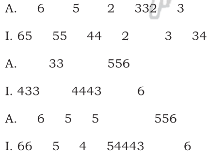

audio::audio/despedida-punena.mpeg[]

Parte I::
Compuertas del alto Puno, tu nomás sabes como lloré.
+
Al despedirme, como sangraba mi corazón.
+
Ay! mi palomita, cómo sangraba mi corazón.

Parte II::
Con un puñal en la mano, quien te ha obligado que me quieras.
+
Ni tampoco nadie a forzado tu voluntad.
+
Ay! mi palomita, nadie ha forzado tu voluntad.

== Treinta años

_Russo Giovani Núñez Miraval_

NOTE: Huayno Calmado

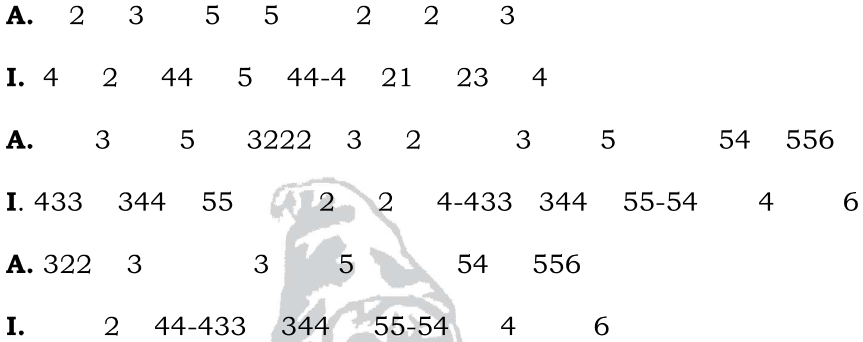

audio::audio/30-anos.mpeg[]

== Kalauyo

audio::audio/kalahuyo.mpeg[]

Parte I::
Kalahuyu rincón huraño, en donde el pajonal ruge, y el viento quema.
+
Donde los frondosos q'ullis, como vigías contamplan las añoranzas de mi querer.
+
Ayayay negra, las añoranzas de mi querer.

Parte II::
El arbol que crece en sombras, entre rocas y peñasco, de nuestro amor sabe.
+
Los truenos son delatores, y las noches son testigos de las ansias de quererte.
+
Ayayay negra, de las ansias de quererte.

== Alessandro

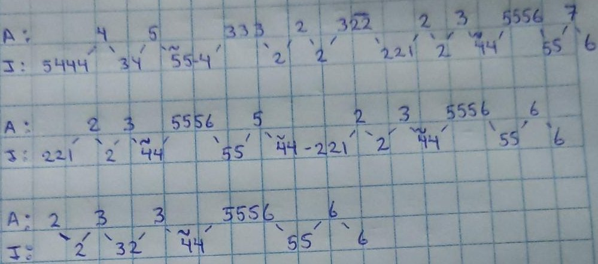

== Azucena

_D.R._

audio::audio/azucena.mpeg[]

Parte I::
Hermosa flor de Azucena, testigo de mis amores, palomita.
+
La rosa floreciendo, y yo pobre padeciendo, palomita.
+
Traicionero amor, y yo pobre padeciendo palomita.

Parte II::
Como quieres que me vaya, sabiendo que te he querido, palomita.
+
La rosa floreciendo y yo pobre padeciendo, palomita
+
Traicionero amor, y yo pobre padeciendo, palomita.

== Diana Juventud

_Tradicional D.R._

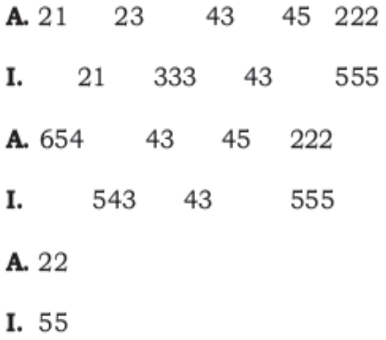

== Diana H'atariy

_Mario Hilari Calderón_

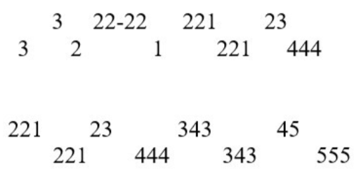

== Flavio

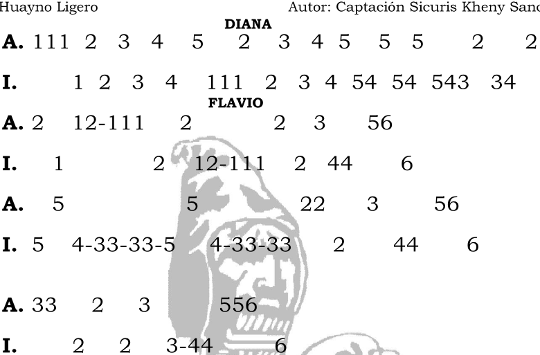
audio::audio/flavio.m4a[]

== Veintinueve de septiembre

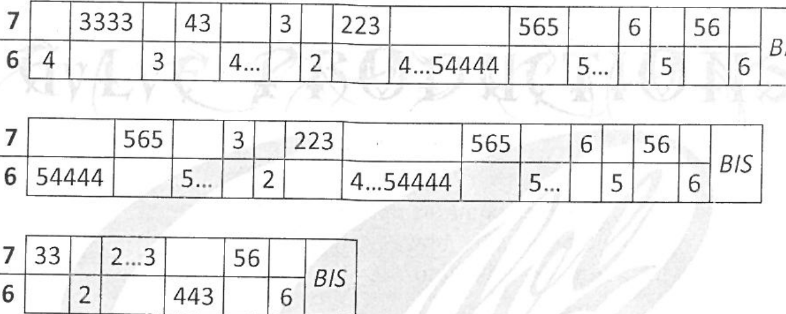
audio::audio/29-septiembre.mpeg[]

Parte I::
Un 29 de septiembre, yo te conocido, al compas de las melodias de nuestro sicuri.
+
En las visperas de San Miguel, al pie de su altar, juraste ser mi compañera, recuerdo imborrable.
+
Conimeña, recuerdo imborrable.

Parte II::
Que más pruebas de mi cariño quieres Conimeña, si hasta en las rocas del calvario se encuentra tu nombre.
+
Bajo las sombras de tus cactus te tuve en mis brazos bebiendo el néctar cristalino de tus labios rojos.
+
Conimeña, de tus labios rojos. +

Parte III::
Hermosa chola Conimeña, vives orgullosa, en el fragor de tus avales al pie del coloso.
+
En las arenas de tu playa escribí tú nombre mirando el cielo de tus ojos, todo un arco iris.
+
Conimeña, todo un arco iris.
